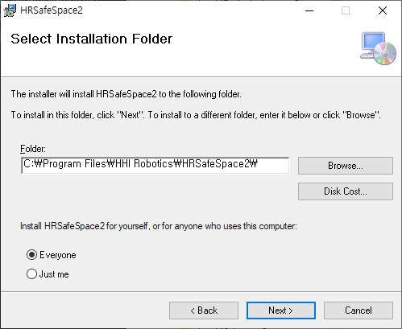
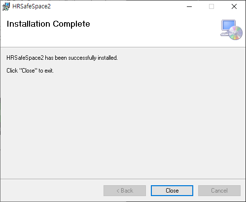

# 2. 설치

- 필수 실행 환경
  * 윈도우10 64bit 및 이후 버전
  * 유선 이더넷 장치

1. [HD현대로보틱스 다운로드 페이지](https://www.hd-hyundairobotics.com/download-center/list)에 접속하여 제품명에서 HRSafeSpace2를 검색하여 다운로드 받으십시오.
(다운로드를 위해서는 회원가입과 로그인이 필요합니다.)

2. 다운로드한 zip 파일을 임의의 폴더에 풀어놓고 setup.exe를 실행하십시오.

3. `Next >` 버튼을 클릭하면서 진행하십시오.
   
	

4. Complete 화면이 나오면 `Close` 버튼으로 설치를 종료하십시오. 
   
	
