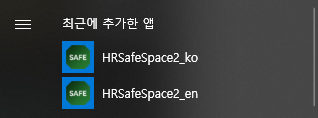

# 3.1 How to Launch the Application


1. Click the HRSafeSpace2 icon on the Windows desktop or from the Start menu.
The `_ko` icon launches the Korean version, and the `_en` icon launches the English version.

   

2. HRSafeSpace2 will start.

   



If the application fails to start, install the following file and try again:

```cmd
C:/Program Files/HHI Robotics/HRSafeSpace2/vc_redist.x64.exe
```

