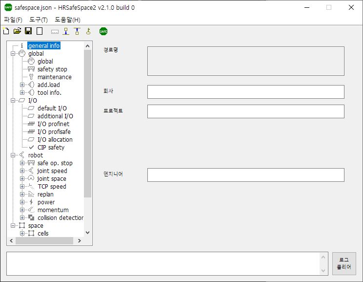

# 3.2 Screen Layout

* At the top, you will find the title bar, pull-down menus, and the toolbar.

* On the left side, a tree view displays all configuration items for SafeSpace2.

* When you select a specific item in the tree, the corresponding configuration screen appears on the right.

* At the bottom, the log window displays various errors and messages.
Clicking the `Clear Log` button on the right side of the log window clears the log entries.
