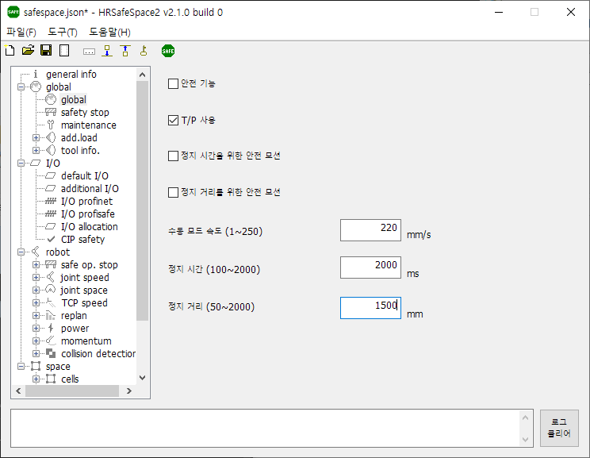
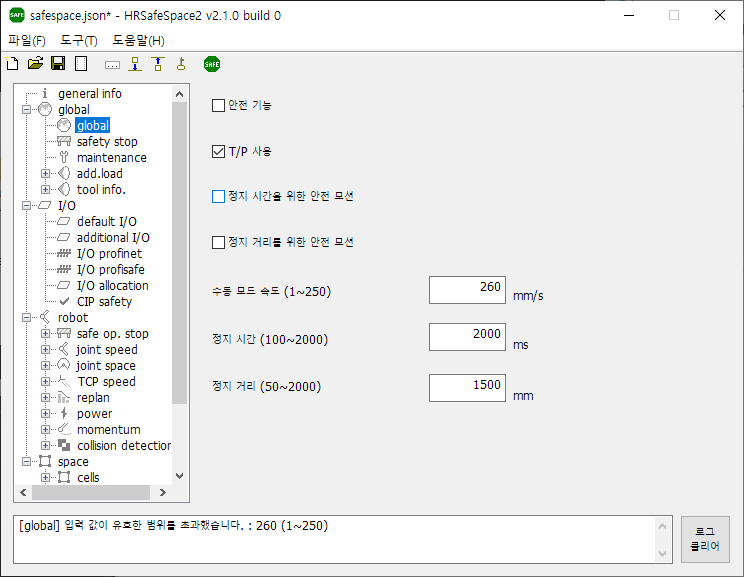

# 3.3 SafeSpace2 설정

- 트리창에서 설정할 항목을 선택한 후, 우측 화면에 값을 설정하십시오.

  

- 트리창의 다른 항목을 선택하여 다른 화면으로 이동하더라도 입력한 값은 메모리에 보존됩니다. (즉, 다른 화면으로 이동하기 전에 저장할 필요 없습니다.)

- 허용한 범위 밖의 값을 입력한 경우, 다른 화면으로 이동을 시도할 경우 이동 실패하며, 하단의 로그 창에 잘못 입력한 값과 적법한 범위가 표시됩니다. 적법한 값으로 정정한 후, 이동하십시오.

  
