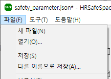
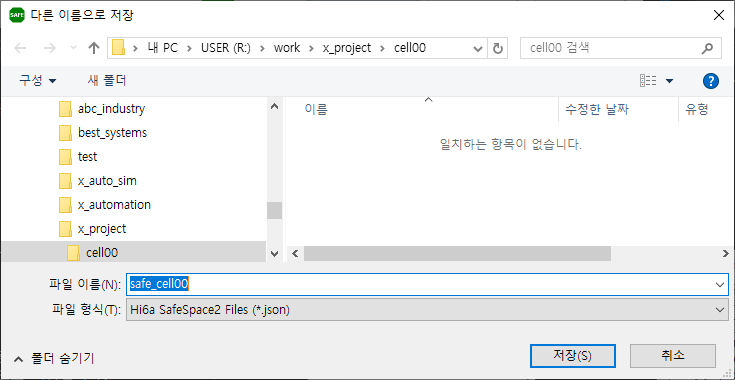
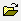
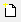

# 3.4 저장과 불러오기

- 설정 내용을 저장하려면, `파일(F) - 저장(S)` 혹은 `파일(F) - 다른 이름으로 저장(A)...` 메뉴를 선택하십시오.

  
  
  혹은 툴 바에서  버튼을 클릭하십시오.  
  

- 저장 대화상자에서 원하는 폴더로 이동 후, 파일명을 입력하십시오. 설정 파일은 .json 포맷으로 저장됩니다.

  

- HRSafeSpace2를 다시 실행했을 때, 저장된 파일을 불러오기하려면, `파일(F) - 열기(O)`  메뉴를 선택하십시오. 혹은 툴 바에서  버튼을 클릭하십시오.

- 저장했던 파일을 선택하면, 설정 내용이 화면에 로드됩니다.

- SafeSpace2의 설정을 디폴트 값으로 다시 시작하려면, `파일(F) - 새 파일(N)` 메뉴를 선택하면 됩니다. 혹은 툴 바에서  버튼을 클릭하십시오.

  