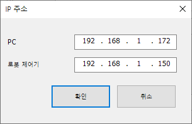

# 4.1 네트워크 설정

1. HRSafeSpace2를 실행한 PC와 Hi7 제어기의 범용 이더넷 포트를 이더넷 케이블로 연결하십시오.

2. PC측 네트워크 아답터의 IP주소는 Hi7 제어기와 같은 서브넷이어야 합니다.

   

3. `도구(T) - IP 주소 설정(A)` 메뉴를 선택하여, IP 주소 설정 대화상자를 여십시오.

   

   혹은 툴 바에서 `IP 주소 설정` 버튼을 클릭하십시오.

   

4. PC측과 로봇 제어기(Hi7) 측의 IP 주소를 각각 입력하고 `확인` 버튼을 클릭하십시오.

   
