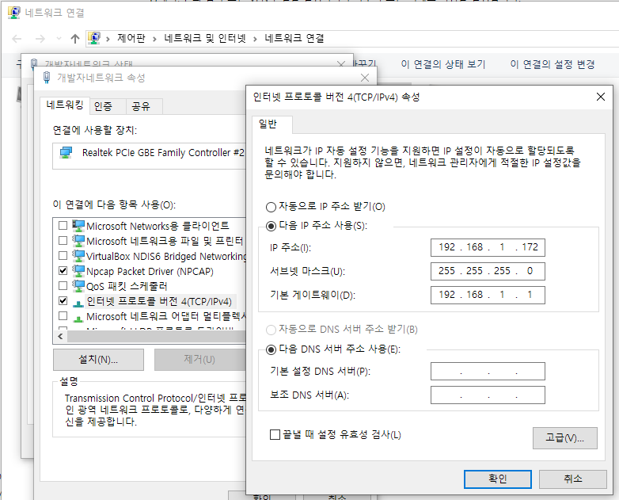
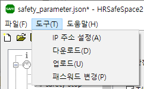

# 4.1 Network Configuration

1. Connect the PC running HRSafeSpace2 to the Hi7 controller's general-purpose Ethernet port using an Ethernet cable.

2. Ensure that the PC's network adapter IP address is on the same subnet as the Hi7 controller.

   

3. Open the IP Address Settings dialog by selecting `Tools - Set IP Address` from the menu.

   

   Alternatively, click the  button on the toolbar:

4. Enter the IP addresses for both the PC and the Hi7 controller, then click `OK`.
