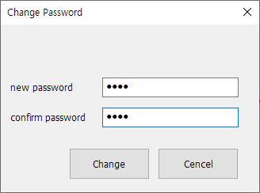
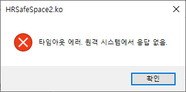
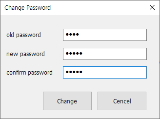

# 4.2 Password

To prevent unauthorized modifications to SafeSpace2 settings, it is mandatory to set a SafeSpace2 password on the Hi7 controller.

## Setting a Password for the First Time

1. Select `Tools - Change Password` from the menu.

   

   Alternatively, click the  button on the toolbar:

2. When the dialog appears, enter the new password in `New Password` and re-enter the same password in `Confirm Password`, then click `Change`.

   

3. If the `Complete` message box appears, the password has been successfully set.

   

4. If a `Timeout Error` message box appears, check the IP address settings, the Ethernet cable connection, or whether the Hi7 controller is functioning properly.

   

## Changing an Existing Password

1. Select `Tools - Change Password` from the menu.

   

   Or click the  button on the toolbar:

2. In the dialog, enter the current password in `Old Password`, the new password in `New Password`, and re-enter the new password in `Confirm Password`, then click `Change`.

   

3. If the `Complete` message box appears, the password has been successfully changed.

   
