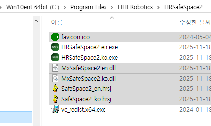
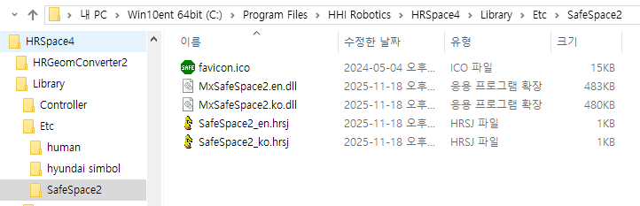

# 5.1 SafeSpace2 플러그인의 설치

1. HRSafeSpace2가 설치된 폴더에서 아래 5개의 파일을 클립보드로 복사합니다.

   * favicon.ico
   * SafeSpace2.en.dll
   * SafeSpace2.ko.dll
   * SafeSpace2_en.hrsj
   * SafeSpace2_ko.hrsj

   

2. HRSpace4가 설치된 폴더에서 Library/Etc/에 SafeSpace2/ 폴더를 생성한 후, 그 안에 파일들을 붙여넣기 합니다.

   
