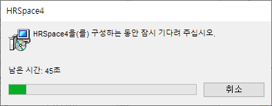

# 5.1 Installing the SafeSpace2 Plug-in

1. Copy the following five files from the folder where HRSafeSpace2 is installed:

   * favicon.ico
   * MxSafeSpace2.en.dll
   * MxSafeSpace2.ko.dll
   * SafeSpace2_en.hrsj
   * SafeSpace2_ko.hrsj

   

2. In the folder where HRSpace4 is installed, create a folder
`SafeSpace2/` on the `Library/Etc/` folder, and paste the copied files into this folder.

   



When launching HRSpace4 for the first time after installing the plug-in, the following dialog may appear.
Please wait until the configuration is complete.

   


