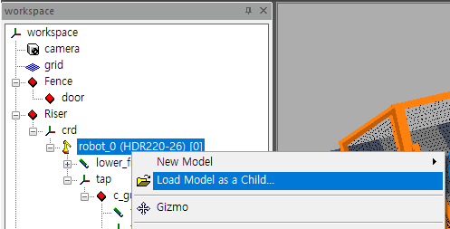
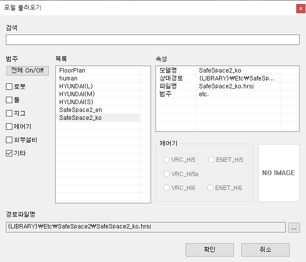
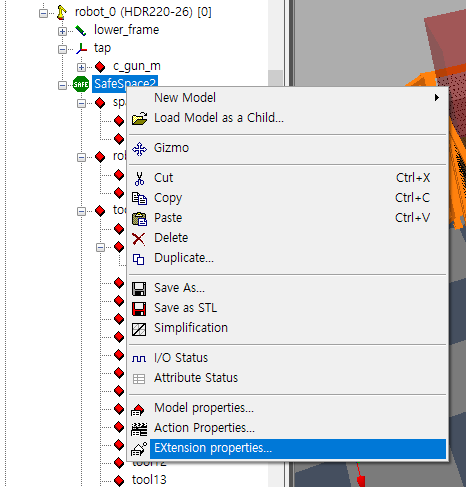
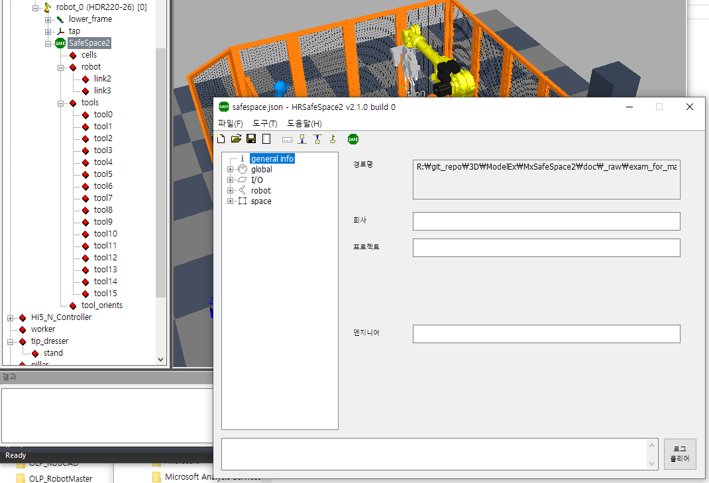

# 5.2 Loading the SafeSpace2 Plug-in

1. In HRSpace4, right-click the robot model in your workspace and select `Load Model...` from the pop-up menu.

   

2. Check the `category - Other`, select `SafeSpace2_ko` from the list, and click `OK`.

   

3. Right-click the SafeSpace2 model created as a sub-model of the robot, and select `Extended Properties...` from the pop-up menu.

   

4. The Extended Properties dialog for the SafeSpace2 model will open, which is the HRSafeSpace2 interface.

   
