# 5.4 작업 공간의 설정

로봇 툴의 동작 범위를 허용된 작업 공간 내로 제한하기 위해 space를 정의해 보겠습니다. XY 평면은 5각형의 펜스 안으로 제한하고, Z축 범위는 0~3400mm 로 제한합시다.

1. 작업 편의를 위해 뷰를 위에서 내려다보는 방향으로 바꿉니다. HRSpace4의 `보기(V)` 리본메뉴에서 `위에서 보기`를 선택합니다. (클릭할 때마다 90도씩 회전합니다.)

   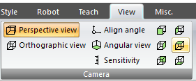

2. 영역 선택에 방해가 되는 기둥(pillar) 모델은 잠시 `스타일 - 보이기`의 체크를 꺼서 감춥니다.

   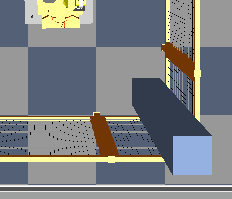
   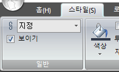

3. 확장 속성에서 `layout/spaces/space 0`을 선택합니다. `일반` 탭에서 활성화 항목을 `항상 on`으로 설정합니다. 아래 그림과 같이 설정되어 있어야 합니다.

   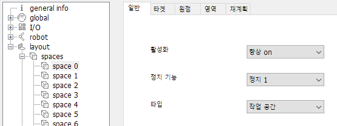

4. `영역` 탭에서 Z max를 20으로 설정하고, 우측의 `입력 시작` 버튼을 클릭합니다. (버튼은 `입력 완료`으로 바뀝니다.) 이제 마우스 좌버튼으로 3D 뷰에서 펜스 5개의 모서리의 약간 안쪽 바닥을 차례로 클릭합니다. 작업 공간을 의미하는 연두색 다각형 평면이 표시됩니다.

   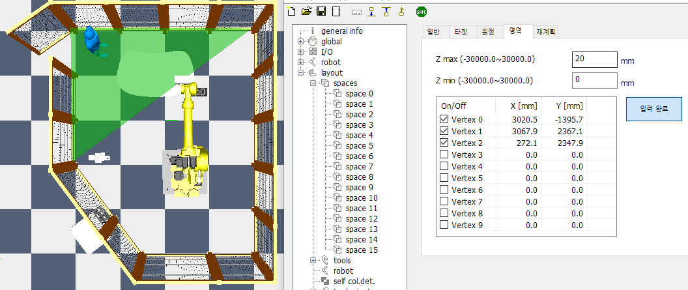

5. 5개의 포인트를 모두 클릭했다면, `입력 완료` 버튼을 클릭합니다. (버튼은 다시 `입력 시작`으로 바뀝니다.) 만일 영역을 다시 선택하고 싶다면, `입력 시작` 버튼을 눌러 이전 정점들을 모두 클리어하고 다시 시작할 수 있습니다.

   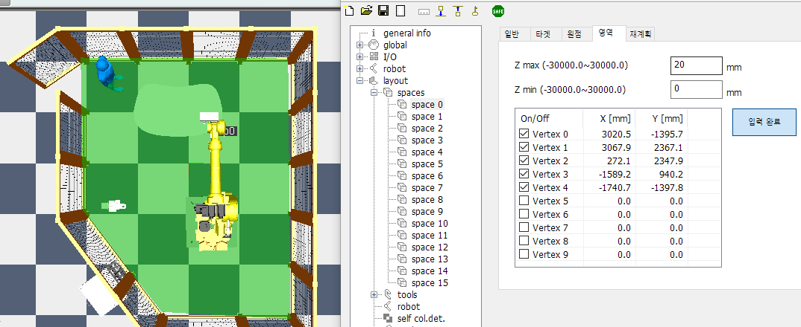

6. 수치를 정밀하게 조정해야 한다면, 테이블 위젯에 직접 수치를 타이핑하면 됩니다. HRSafeSpace의 저장(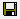) 버튼을 눌러야 3D 뷰에 반영됩니다.

   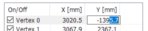

7. 이제 뷰를 회전시켜서 옆에서 확인해 봅시다. default Z 범위 설정이 20 ~ 0 mm이기 때문에, 옆에서 보면 작업 공간은 로봇 바닥 높이로 납작하게 형성되어 있습니다.

   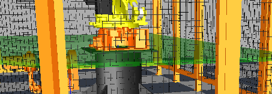

8. 로봇 좌표계의 높이가 800mm이고, Z축 범위는 월드 좌표계 기준 0~3400mm이어야 하므로, 로봇 좌표계 기준으로 Zmin~Zmax는 -800~2600mm 범위로 설정해야 합니다. 값 입력 후, HRSafeSpace의 저장() 버튼을 클릭하면, 아래와 같이 설정이 완료됩니다.

   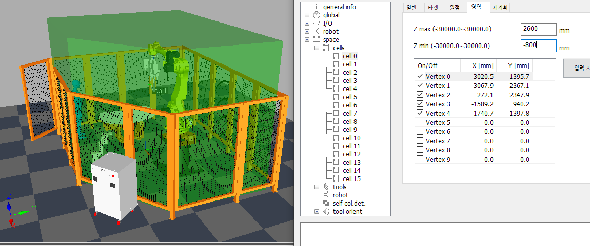

9. `홈(H) - 기즈모`를 열고, 크기 조정 모드로 Z축을 드래그하여 Zmax를 조정할 수도 있습니다. (Zmin 등 다른 설정은 조정할 수 없습니다.)

   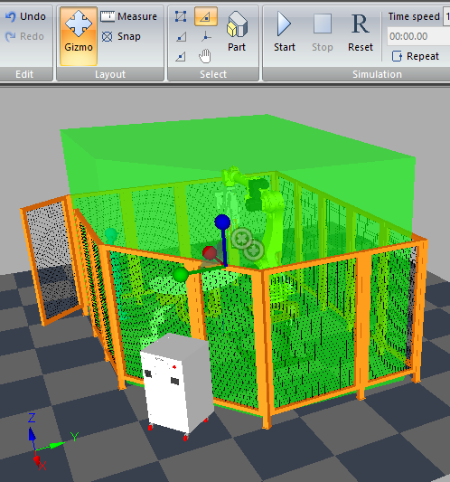

10. 설정된 작업 공간 형상이 셀을 채우고 있어서, 다른 설정에 방해가 됩니다. `일반` 탭에서 활성화 항목을 `항상 off`로 설정하면, 작업 공간 형상이 일단 감춰집니다. 다른 설정을 모두 완료한 후 다시 `항상 on`으로 바꾸도록 합시다.
