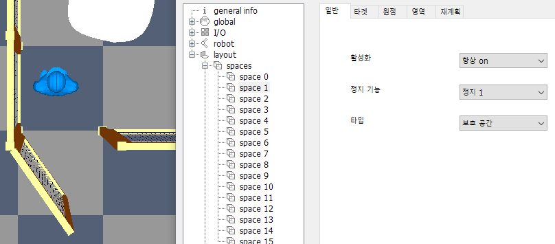
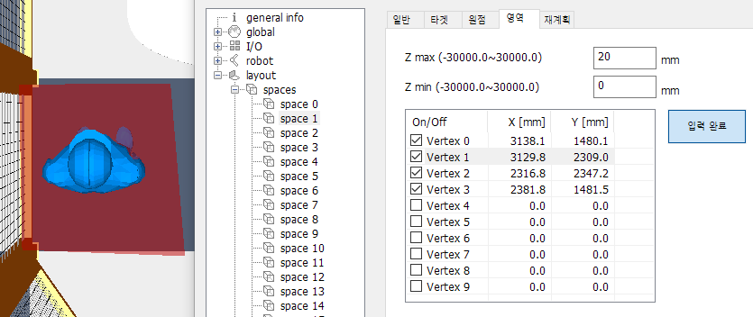
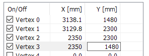
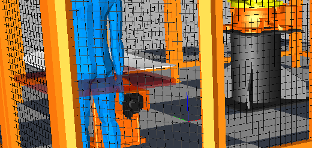
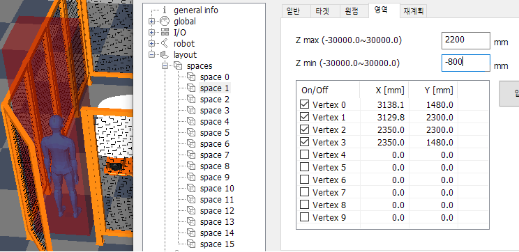

# 5.5 보호 공간의 설정

인간 작업자가 서 있을 수 있는 장소를 보호 공간으로 지정합시다.

1. 작업 편의를 위해 뷰를 위에서 내려다보는 방향으로 바꿉니다. HRSpace4의 `보기(V)` 리본메뉴에서 `위에서 보기`를 선택합니다.

   

2. 확장 속성에서 `layout/spaces/space 1`을 선택합니다. `일반` 탭에서 활성화 항목을 `항상 on`으로 설정하고, 타입은 `보호 공간`으로 설정합니다. 아래 그림과 같이 설정되어 있어야 합니다.

   

3. `영역` 탭에서 Z max를 20으로 설정하고, 우측의 `입력 시작` 버튼을 클릭합니다. (버튼은 `입력 완료`로 바뀝니다.) 이제 마우스 좌버튼으로 3D 뷰에서 인간 작업자 주변의 바닥 4개의 지점을 차례로 클릭합니다. 보호 공간을 의미하는 빨간색 다각형 평면이 표시됩니다.

   

4. 4개의 포인트를 모두 클릭했다면, `입력 완료` 버튼을 클릭합니다. (버튼은 다시 `입력 시작`으로 바뀝니다.) 만일 영역을 다시 선택하고 싶다면, `입력 시작` 버튼을 눌러 이전 정점들을 모두 클리어하고 다시 시작할 수 있습니다.

5. 수치를 정밀하게 조정해야 한다면, 테이블 위젯에 직접 수치를 타이핑하면 됩니다. 저장 버튼을 눌러야 3D 뷰에 반영됩니다.

   

7. 이제 뷰를 회전시켜서 옆에서 확인해 봅시다. default Z 범위 설정이 20 ~ 0 mm이기 때문에, 옆에서 보면 보호 공간은 로봇 바닥 높이로 납작하게 형성되어 있습니다.

   

8. 로봇 바닥 높이가 800mm 이므로, 보호 공간의 높이를 3000mm로 한다면 Zmin~Zmax를 -800~2200mm 범위로 설정하면 됩니다. 값 입력 후, 확장 속성(HRSafeSpace)의  버튼을 클릭하면, 아래와 같이 설정이 완료됩니다.

   
