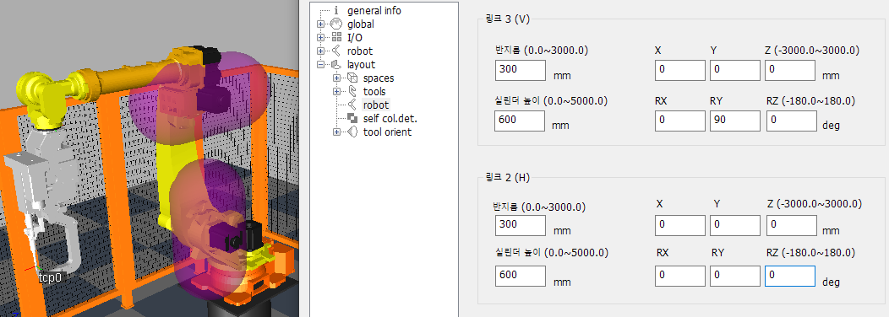
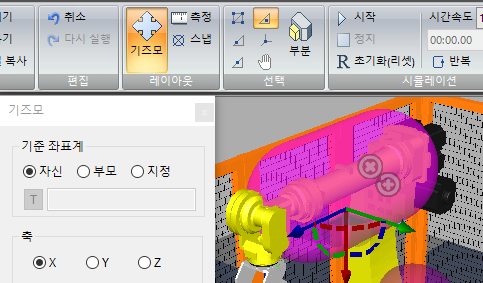
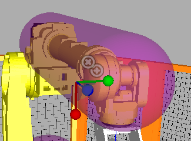
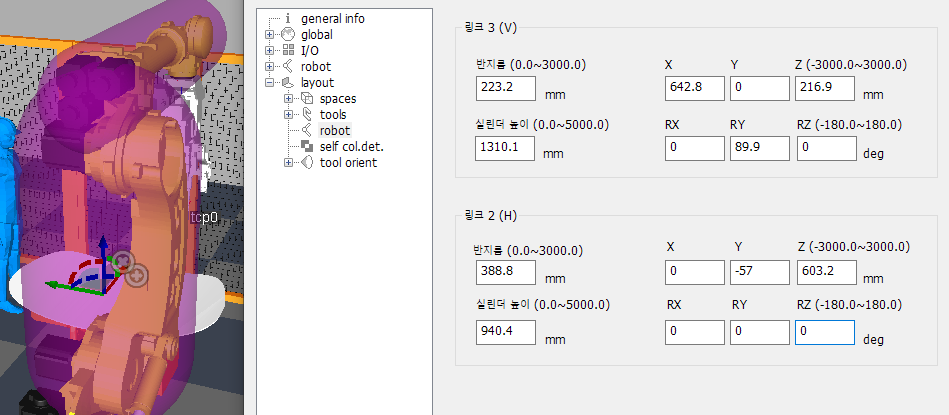

# 5.6 로봇 링크의 설정

로봇의 upper_frame과 arm_frame에 캡슐 영역을 씌워서, 충돌을 예방할 수 있습니다. 

1. 확장 속성에서 `layout/robot`을 선택합니다. 링크 3, 링크 2에 대해 각기 아래와 같이 변경하고  버튼을 클릭하면, 두 링크의 위치에 각기 캡슐 영역이 나타납니다.

   - 링크 3 (V)
     * 반지름: 300mm 
     * 실린더 높이: 600mm
     * RY : 90 deg

   - 링크 2 (H)
     * 반지름: 300mm 
     * 실린더 높이: 600mm     

   

2. `홈(H) - 기즈모`를 열고, 링크 3의 캡슐을 선택합니다. 기즈모를 크기 모드와 위치 모드로 전환해 가면서 캡슐의 크기와 위치를 링크 3를 포함하도록 적당히 조정합니다.

   

   

3. 링크 2의 캡슐을 선택하여, 같은 방법으로 캡슐의 크기와 위치를 링크 2를 포함하도록 적당히 조정합니다. 기즈모로 조작한 결과는 확장 속성 대화상자에 즉각적으로 반영됩니다.

   

