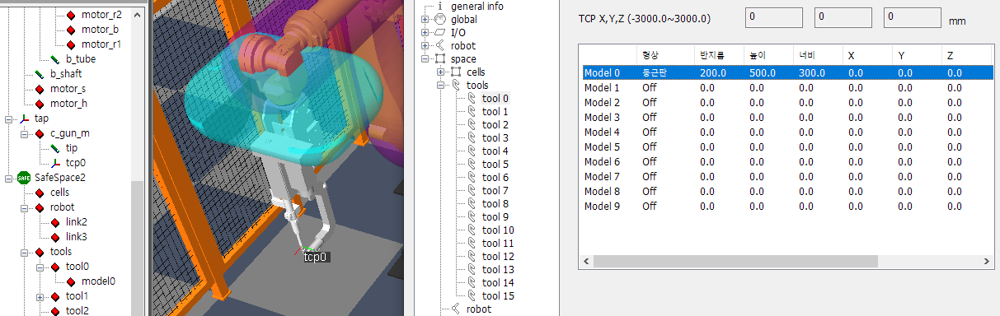
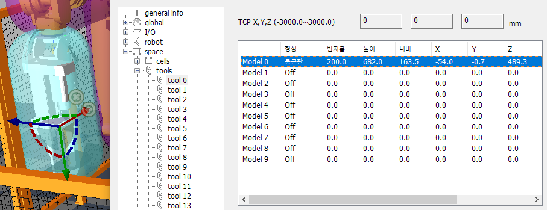
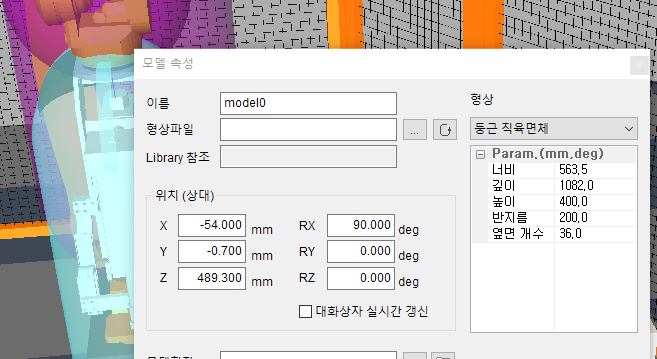
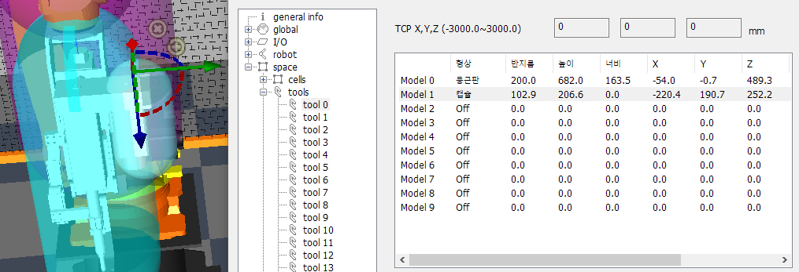

# 5.6 툴의 설정

로봇의 툴에 다양한 형상의 영역을 씌워서, 충돌을 예방할 수 있습니다. 

1. 확장 속성에서 `space/tools/tool0`을 선택합니다. 각 툴 번호의 형상은 최대 10개의 모델을 조합하여 구성할 수 있습니다. 우선 Model 0의 형상을 아래와 같이 설정하고  버튼을 클릭하면 로봇 프렌지 좌표계에 형상이 나타납니다.

   * 형상: `둥근판`
   * 반지름: 200mm
   * 높이: 500mm
   * 너비: 300mm
   * 나머지 항목은 0

   

2. 형상이 툴 전체를 포함하도록, 기즈모를 사용하여 Model 0을 이동, 회전, 크기 조정하십시오. 기즈모로 조작한 결과는 확장 속성 대화상자에 즉각적으로 반영됩니다.

   

3. 크기나 위치의 정밀하게 조정해야 한다면, Model 0의 모델 속성을 열여 직접 수치를 타이핑해 수정해도 됩니다.

   

4. Model 0 형상 바깥으로 튀어나온 부분이 있으므로, Model을 하나 더 추가하겠습니다. Model 1에 아래와 같이 캡슐을 생성한 후, 마찬가지로 기즈모를 사용하여 튀어나온 부분을 덮어주십시오.

   * 형상: `캡슐`
   * 반지름: 200mm
   * 높이: 500mm
   * 나머지 항목은 0

   
