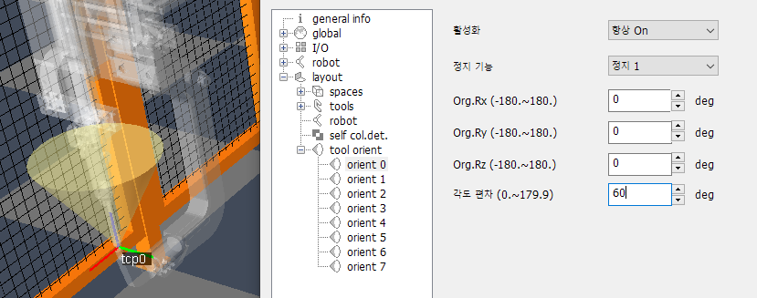
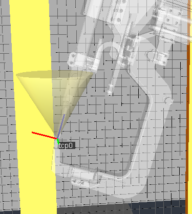
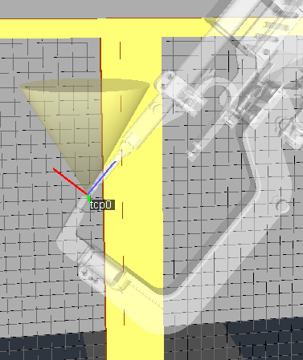

# 5.8 툴 방향의 설정

로봇의 툴이 가리키는 방향을 특정한 각도 범위로 제한하고 싶다면, 툴 방향 (tool_orients) 설정 항목을 사용할 수 있습니다.

(시험 및 설명의 편의를 위해, 이전 절에 실습한 tool 형상은 삭제했으며, 스폿 용접 건 툴은 스타일 - 투명도를 60%로 조정했습니다.)

1. 확장 속성에서 `space/tool_orients`를 선택합니다. 각도 편차를 60 deg로 입력한 후  버튼을 클릭하면 로봇 프렌지 좌표계에 원뿔 모양의 툴 방향 범위가 표시됩니다.

   

2. Org.Rx, Ry, Rz가 (0, 0, 0)deg 일 때, 원뿔은 로봇좌표계 기준으로 하늘로 향하는 +Z방향으로 퍼져 나가는 형상이 됩니다. 이 원뿔 범위 60 deg는 TCP의 +Z축을 제한합니다.
   아래 그림은 TCP의 Z축이 허용 범위 내에 있는 상황과, 범위를 벗어난 상황의 예를 보여주고 있습니다.

<table>
   <tr>
      <td>
         
      </td>
      <td>
         
      </td>
   </tr>
   <tr>
      <td align='center'>
         범위 내에 있음.
      </td>
      <td align='center'>
         범위를 벗어남.
      </td>
   </tr>
</table>   

3. 툴 방향의 범위 크기나 방향의 수치를 수정한 후 다시  버튼을 클릭하면, 3D 뷰에도 반영됩니다.
