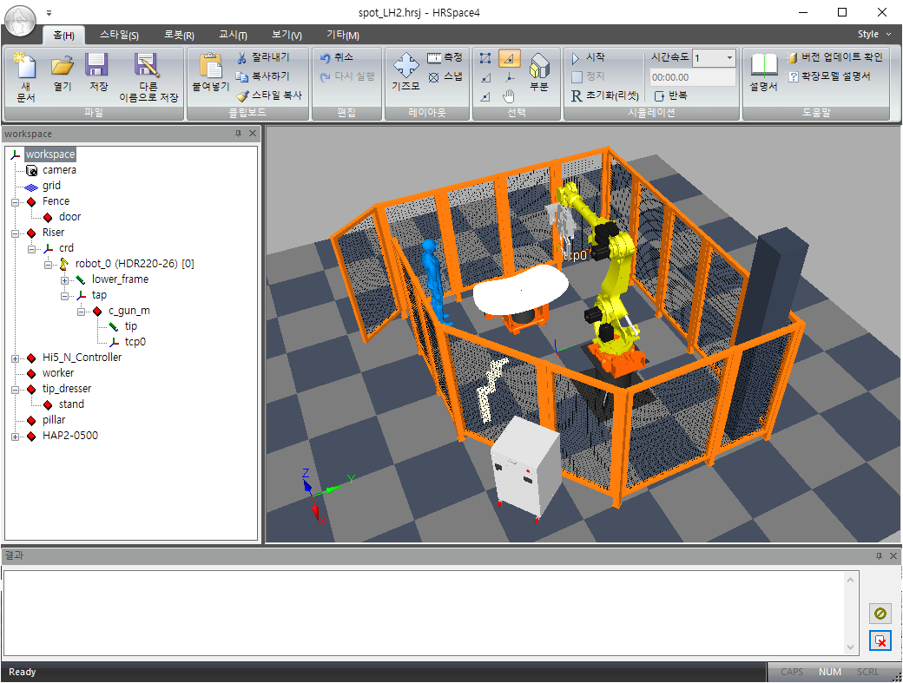

# 5. HRSpace4 연동

이번 장에서는 HRSpace4 프로젝트에 HRSafeSpace2를 플러그인 (Plug-in) 형태로 로드하여, 3D 가상 워크스페이스에서 Safety 레이아웃을 비주얼하게 편집하는 방법을 설명합니다.



HRSpace4가 설치되어 있지 않다면, [HD현대로보틱스 다운로드 페이지](https://www.hd-hyundairobotics.com/download-center/list)에 접속하여 제품명에서 HRSpace를 검색하여 최신 버전을 다운로드 받아 설치하십시오.

HRSpace v4.3.2.0 이상이 필요합니다.



HRSpace4에서 아래와 같은 로봇 스폿 용접 셀의 레이아웃을 설계했다고 가정합시다.

   

HDR220-26 매니퓰레이터 한 대가 셀 안에 설치되어 있습니다. 로봇 플랜지에는 C-타입 스폿 용접건(c_gun_m)이 장착되어 있으며, 로봇은 높이 800mm의 보고대(riser) 위에 설치되어 있습니다. 각 작업 사이클의 시작 시, 작업자가 로봇 전면의 포지셔너(positioner)에 용접 작업물을 장착합니다. 로봇은 작업물에 대해 스폿 용접을 수행하며, 간헐적으로 팁 드레서(tip_dresser)로 드레싱을 수행합니다.

전체 셀은 5면 펜스(fence)로 둘러싸여 있습니다. 또한, 천장 구조물과의 충돌을 막기 위해 로봇 툴의 Z축 범위는 셀 바닥을 기준으로 0~3400mm 영역으로 제한되며, 펜스 내부에는 기둥이 하나 존재한다고 가정합니다.

우리는 HRSpace4 비주얼 편집 연동 기능의 도움을 받아 SafeSpace2 설정 파라미터를 작성한 뒤, 생성된 safety_parameter.json 파일을 실제 Hi7 로봇 컨트롤러에 다운로드하게 될 것입니다.
